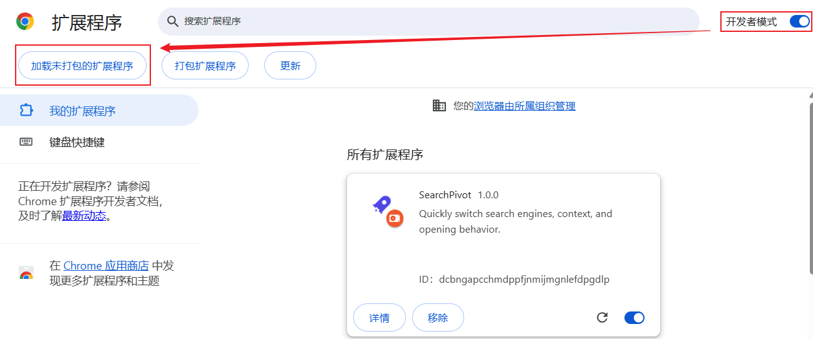

# 🚀SearchPivot - 高效搜索引擎管理中枢

**极简 · 高效 · 自定义**

SearchPivot 是一款轻量级的 Chrome 浏览器扩展，旨在实现高效的搜索引擎切换管理。它允许你在一个统一的界面中，一键切换不同的搜索引擎或垂直内容站点，并灵活控制搜索结果的打开方式。

---

## ✨ 核心特性

* **⚡️ 一键切换引擎**：内置 Google、Bing、百度、DuckDuckGo 等主流搜索引擎，以及 GitHub、Bilibili、YouTube 等常用垂直站点。
* **🎯 灵活的打开方式**：
    * **当前页**：在当前标签页加载结果。
    * **新标签**：后台或前台打开新标签页（默认）。
    * **新窗口**：在全新窗口中搜索。
    * **无痕模式**：一键在隐身窗口中搜索，保护隐私。
* **🛠 高度自定义**：支持添加任意符合 URL 规则的搜索引擎。在设置页面，你可以把公司内部 Wiki、特定的文档库或任何你喜欢的网站变成搜索入口。

* **🧠 智能上下文**：打开插件时，自动捕获当前页面的搜索关键词（如已在 Google 搜索，打开插件会自动填入刚才的词，方便快速跳转到其他引擎）。
* **🎨 简洁现代 UI**：扁平化设计，无广告，无干扰。

## 📥 安装指南

请从 GitHub 下载源代码，并按照以下步骤安装：

1.  下载本仓库代码并解压（或 `git clone`）。
2.  在 Chrome 浏览器地址栏输入 `chrome://extensions/` 并回车。
3.  打开右上角的 **"开发者模式"** 开关。
4.  点击左上角的 **"加载已解压的扩展程序"** 按钮。
5.  选择本项目文件夹即可。

## 📖 使用手册

### 1. 基础搜索
1.  点击浏览器右上角的 SearchPivot 图标（建议将其固定在工具栏）。
2.  在输入框输入关键词。
3.  点击下方的任意图标，或直接按 **回车键** 使用当前选中的引擎搜索。

### 2. 切换打开行为
在插件底部，你可以随时切换搜索结果的打开位置：
* `当前页`
* `新标签` (推荐)
* `新窗口`
* `无痕`

### 3. 管理与自定义引擎
点击右上角的 **设置 (⚙️)** 图标进入管理面板。

* **添加引擎**：
    * **名称**：起一个容易识别的名字。
    * **URL**：输入搜索链接，并将关键词部分替换为 `%s`。
        * *示例*：`https://www.zhihu.com/search?type=content&q=%s`
    * **图标**：支持输入图片 URL，或**上传本地图片**（推荐 48x48 左右的小图标）。
* **编辑/删除**：在**我的引擎列表中**点击对应的铅笔或垃圾桶图标即可。

## ⌨️ 快捷键

* **打开插件**：建议在 `chrome://extensions/shortcuts` 中为 SearchPivot 设置全局快捷键（如 `Ctrl+Shift+F` 或 `Alt+S`），以实现全键盘操作。
* **执行搜索**：输入文字后直接按 `Enter`。

## 🔒 隐私与权限说明

SearchPivot **不收集**任何用户数据。

所申请权限的用途说明：
* `storage`: 仅用于保存您的自定义引擎列表和偏好设置（所有数据均存储在您的本地浏览器中）。
* `activeTab` / `tabs`: 用于获取当前标签页的 URL（以便实现“智能填入搜索词”功能）以及控制在新标签页中打开搜索结果。
* `scripting`: 辅助用于部分页面的交互控制。

## 🤝 贡献与反馈

本项目为纯AI生成项目，由  `Google AI Studio` - `Gemini 3 Pro Preview`  完成所有功能开发。

欢迎提交 Issue 反馈 Bug 或建议新功能！如果你喜欢这个项目，欢迎 Fork 并提交 Pull Request。

1.  Fork 本仓库
2.  创建你的特性分支 (`git checkout -b feature/AmazingFeature`)
3.  提交你的修改 (`git commit -m 'Add some AmazingFeature'`)
4.  推送到分支 (`git push origin feature/AmazingFeature`)
5.  开启一个 Pull Request

## 📄 开源协议

本项目采用 [MIT License](LICENSE) 开源协议。